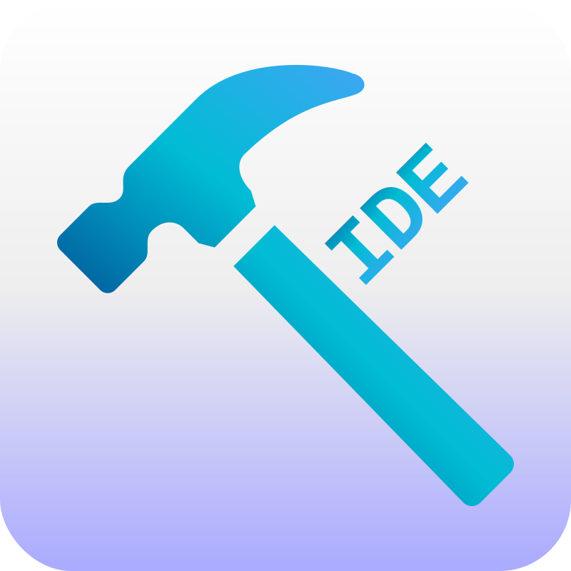
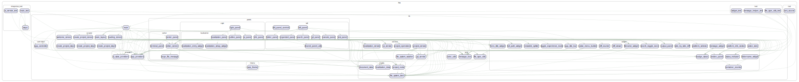

# FIDE - Flutter Integrated Developer Environment

FIDE is an open-source, opinionated IDE specifically designed for Flutter development. Unlike general-purpose IDEs, FIDE is dedicated to providing the best possible experience for Flutter app development, with features tailored to Flutter workflows and conventions.

Built entirely with Flutter, FIDE offers a clean, efficient development environment optimized for Flutter applications.

## Philosophy

FIDE is not a general-purpose IDE. It is specifically crafted for Flutter developers who want a focused, opinionated tool that understands Flutter's unique development patterns. We believe in:

- **Flutter-First Design**: Every feature is designed with Flutter development in mind
- **Opinionated Workflows**: Curated experiences that follow Flutter best practices
- **Integrated Ecosystem**: Seamless integration with Flutter tools and conventions
- **Open Source Commitment**: Community-driven development with transparency

## Features

- **Project Explorer**: Navigate and manage your Flutter project structure with multiple view modes
  - **Folder View**: Traditional hierarchical file tree with expansion/collapse
  - **Organized View**: Categorized project structure (Root, Lib, Tests, Assets, Platforms, Output)
  - **Git View**: Git status integration with staged, unstaged, and untracked files
- **Code Editor**: Full-featured code editing with syntax highlighting for Dart/Flutter
- **Terminal Panel**: Built-in terminal for running Flutter commands
- **Git Integration**: Comprehensive Git workflow management
  - View repository status with staged, unstaged, and untracked files
  - Stage/unstage individual files or all files at once
  - Commit changes with detailed commit messages
  - View file diffs and recent commits
  - Push and pull operations
  - Click any file in Git view to open it in the editor
- **AI Panel**: AI-assisted development features
- **Outline Panel**: Navigate code structure and symbols
- **Multi-Panel Layout**: Customizable left, center, and right panels
- **Unified File Rendering**: Consistent file and folder display across all panels with Git status indicators
- **Theme Support**: Light, dark, and system theme modes
- **Cross-Platform**: Native builds for Windows, macOS, and Linux
- **MRU Projects**: Quick access to recently opened Flutter projects

## Getting Started

1. Clone this repository
2. Run `flutter pub get` to install dependencies
3. Run `flutter run` to start the app
4. Open a Flutter project folder to begin development

## Building

To build for your platform, run:

- Windows: `flutter build windows`
- macOS: `flutter build macos`
- Linux: `flutter build linux`

## Requirements

- Flutter SDK installed and configured
- Dart SDK (comes with Flutter)

## Contributing

Contributions are welcome! FIDE is an open-source project dedicated to improving Flutter development. Please:

1. Open an issue first to discuss what you'd like to change
2. Follow Flutter development best practices
3. Ensure your changes align with FIDE's opinionated Flutter-first philosophy

## Project Assets

FIDE includes visual assets that help illustrate the project structure:

### Dependency Graph

An automatically generated visualization of the codebase dependencies, showing how different modules and services interconnect within the FIDE architecture.

## License

This project is licensed under the MIT License - see the LICENSE file for details.
