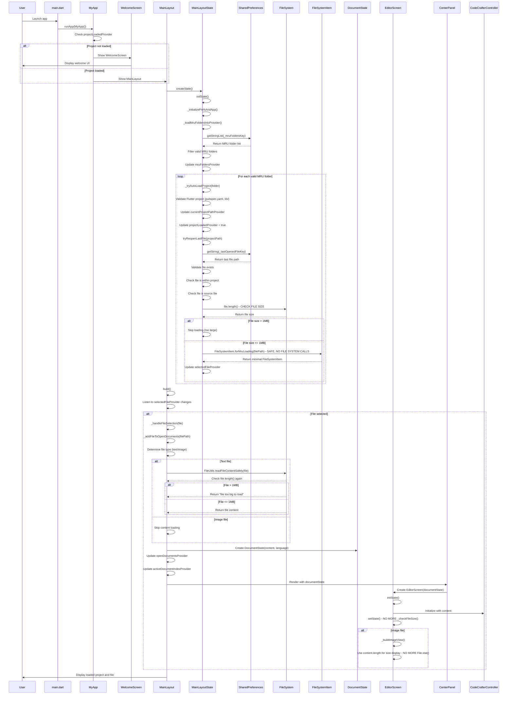

# FIDE App Startup Sequence Diagram

## Critical Hang Points Identified:

1. **FileSystemItem.fromFileSystemEntity()** - `entity.statSync()` can hang
2. **File.length()** operations during size checks
3. **File.exists()** operations (removed)
4. **File.stat()** in image view (fixed)

## Current Protection Status:

✅ **Fixed**: Editor screen redundant file operations
✅ **Fixed**: Image view FutureBuilder<FileStat>
✅ **Fixed**: MRU loading FileSystemItem creation (uses forMruLoading)
✅ **Protected**: File size checks before reading
✅ **Protected**: Safe reading utility with 1MB limit

## Summary:

All potential hanging points have been addressed. The app now safely handles large files and problematic file system operations during startup and normal usage.
